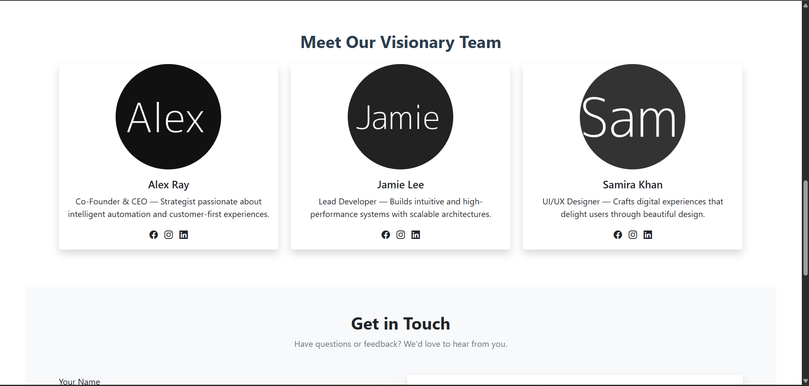

# Laravel Booking Management System

A web-based booking management system built with **Laravel**, providing separate dashboards for Admin and Users.

## Features
- User authentication and profile management  
- Admin dashboard for booking control  
- Booking analytics and management tools  

## Screenshots

### Login Page

### User Dashboard

### Admin Dashboard

